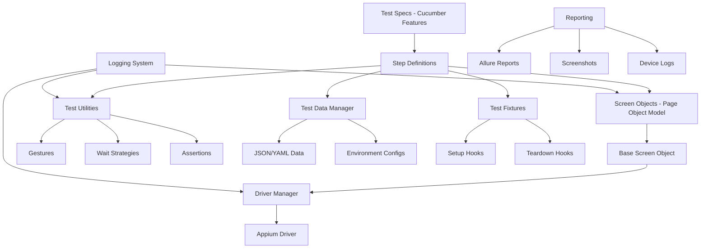

# Galaxy Me Mobile Testing Framework - Architecture Documentation

## Executive Summary

This document outlines the comprehensive architecture for the **Galaxy Me** enterprise-grade end-to-end mobile testing framework using Appium. The framework follows Behavior-Driven Development (BDD) principles with Cucumber, implements industry-leading design patterns, and maintains consistency with existing `pos-web` and `galaxy-pink-web` projects.

**Framework Version:** 1.0.0
**Application:** Galaxy Me (v1.2.3)
**Last Updated:** 2025-11-07
**Status:** Architecture Design Phase

---

## Table of Contents

1. [Application Information](#1-application-information)
2. [Framework Architecture](#2-framework-architecture)
3. [Project Structure](#3-project-structure)
4. [Three-Phase Testing Lifecycle](#4-three-phase-testing-lifecycle)
5. [Page Object Model Design](#5-page-object-model-design)
6. [Configuration Management](#6-configuration-management)
7. [Test Data Management](#7-test-data-management)
8. [Utility Library](#8-utility-library)
9. [Error Handling & Logging](#9-error-handling--logging)
10. [Reporting Strategy](#10-reporting-strategy)
11. [CI/CD Integration](#11-cicd-integration)
12. [Cross-Platform Abstraction](#12-cross-platform-abstraction)
13. [Accessibility Testing](#13-accessibility-testing)
14. [Dependencies](#14-dependencies)
15. [Getting Started](#15-getting-started)
16. [Best Practices](#16-best-practices)
17. [Troubleshooting](#17-troubleshooting)

---

## 1. Application Information

### 1.1 Application Identifiers

```yaml
Android:
  packageName: "com.xsofts.galaxyme"  # To be confirmed
  appActivity: ".MainActivity"         # To be confirmed
  buildVersion: "1.2.3"
  buildFile: "GalaxyMe_1.2.3_PROD_2025-Nov-07_0423.apk"

iOS:
  bundleId: "com.xsofts.galaxyme"     # To be confirmed
  buildVersion: "1.2.3"
  buildFile: "GalaxyMe-1.2.3.ipa"     # To be provided
```

### 1.2 Supported Platforms

| Platform | Versions | Priority | Notes |
|----------|----------|----------|-------|
| Android  | API 29+ (Android 10+) | High | Production target |
| Android  | API 33 (Android 13) | Medium | Latest testing |
| Android  | API 34 (Android 14) | Low | Future support |
| iOS      | iOS 15.0+ | High | Production target |
| iOS      | iOS 16.0+ | Medium | Latest features |
| iOS      | iOS 17.0+ | Low | Future support |

### 1.3 Critical Application Features

**Priority for Initial Test Coverage:**
1. User Authentication & Authorization
2. Profile Management
3. Appointment Booking
4. Payment Processing
5. Customer Management

---

## 2. Framework Architecture

### 2.1 Design Principles

The framework adheres to SOLID principles and industry best practices:

- **Single Responsibility Principle**: Each class has one responsibility
- **Open/Closed Principle**: Open for extension, closed for modification
- **Liskov Substitution Principle**: Screen objects are substitutable
- **Interface Segregation**: Focused interfaces for different concerns
- **Dependency Inversion**: Depend on abstractions, not concretions

### 2.2 Architecture Layers



### 2.3 Technology Stack

| Category | Technology | Version | Purpose |
|----------|-----------|---------|---------|
| Test Runner | WebdriverIO | ^9.x | Appium test execution |
| BDD Framework | Cucumber | ^11.x | BDD test structure |
| Language | TypeScript | ^5.9.x | Type-safe development |
| Mobile Automation | Appium | ^2.x | Mobile driver protocol |
| Reporting | Allure | ^3.x | Test reporting |
| Logging | Winston | ^3.x | Structured logging |
| Validation | Zod | ^4.x | Schema validation |
| Utilities | Remeda | ^2.x | Functional utilities |

---

## 3. Project Structure

### 3.1 Complete Directory Layout

```
e2e/galaxy-me/
├── package.json                      # Project dependencies & scripts
├── tsconfig.json                     # TypeScript configuration
├── wdio.config.ts                    # WebdriverIO/Appium configuration
├── .env.example                      # Environment template
├── .eslintrc.json                    # Linting rules
├── README.md                         # Project documentation
├── ARCHITECTURE.md                   # This document
│
├── src/
│   ├── config/                       # Configuration management
│   │   ├── appium.config.ts         # Appium capabilities
│   │   ├── devices.config.ts        # Device configurations
│   │   ├── env.config.ts            # Environment variables
│   │   └── test.config.ts           # Test execution settings
│   │
│   ├── screens/                      # Page Object Model
│   │   ├── base/
│   │   │   ├── BaseScreen.ts        # Base screen object class
│   │   │   ├── AndroidScreen.ts     # Android-specific base
│   │   │   └── IosScreen.ts         # iOS-specific base
│   │   │
│   │   ├── auth/
│   │   │   ├── LoginScreen.ts       # Login screen object
│   │   │   ├── SignupScreen.ts      # Signup screen object
│   │   │   └── ForgotPasswordScreen.ts
│   │   │
│   │   ├── profile/
│   │   │   ├── ProfileScreen.ts     # Profile management
│   │   │   └── EditProfileScreen.ts
│   │   │
│   │   ├── appointment/
│   │   │   ├── AppointmentListScreen.ts
│   │   │   ├── BookAppointmentScreen.ts
│   │   │   └── AppointmentDetailScreen.ts
│   │   │
│   │   └── index.ts                 # Screen exports
│   │
│   ├── steps/                        # Cucumber step definitions
│   │   ├── fixtures.ts              # Test fixtures & hooks
│   │   ├── auth.steps.ts            # Authentication steps
│   │   ├── profile.steps.ts         # Profile management steps
│   │   ├── appointment.steps.ts     # Appointment steps
│   │   ├── common.steps.ts          # Reusable common steps
│   │   └── parameters.ts            # Custom parameter types
│   │
│   ├── features/                     # Cucumber feature files
│   │   ├── auth/
│   │   │   ├── login.feature        # Login scenarios
│   │   │   ├── signup.feature       # Signup scenarios
│   │   │   └── logout.feature       # Logout scenarios
│   │   │
│   │   ├── profile/
│   │   │   ├── view-profile.feature
│   │   │   └── edit-profile.feature
│   │   │
│   │   └── appointment/
│   │       ├── book-appointment.feature
│   │       └── cancel-appointment.feature
│   │
│   ├── utils/                        # Utility functions
│   │   ├── gestures/
│   │   │   ├── swipe.util.ts        # Swipe gestures
│   │   │   ├── tap.util.ts          # Tap gestures
│   │   │   ├── scroll.util.ts       # Scroll utilities
│   │   │   └── pinch.util.ts        # Pinch/zoom gestures
│   │   │
│   │   ├── wait/
│   │   │   ├── explicit-wait.ts     # Explicit wait strategies
│   │   │   ├── element-wait.ts      # Element-specific waits
│   │   │   └── state-wait.ts        # App state waits
│   │   │
│   │   ├── device/
│   │   │   ├── keyboard.util.ts     # Keyboard interactions
│   │   │   ├── orientation.util.ts  # Device orientation
│   │   │   ├── network.util.ts      # Network conditions
│   │   │   └── notification.util.ts # Push notifications
│   │   │
│   │   ├── screenshot.util.ts       # Screenshot capture
│   │   ├── logger.util.ts           # Logging utilities
│   │   └── assertion.util.ts        # Custom assertions
│   │
│   ├── data/                         # Test data
│   │   ├── users/
│   │   │   ├── admin.json           # Admin user data
│   │   │   ├── customer.json        # Customer user data
│   │   │   └── technician.json      # Technician user data
│   │   │
│   │   ├── appointments/
│   │   │   └── test-appointments.json
│   │   │
│   │   ├── environments/
│   │   │   ├── dev.json             # Development environment
│   │   │   ├── staging.json         # Staging environment
│   │   │   └── production.json      # Production environment
│   │   │
│   │   └── fixtures/
│   │       └── test-fixtures.json   # Test fixture data
│   │
│   ├── types/                        # TypeScript type definitions
│   │   ├── common.types.ts          # Common types
│   │   ├── config.types.ts          # Configuration types
│   │   ├── screen.types.ts          # Screen object types
│   │   ├── test-data.types.ts       # Test data types
│   │   └── index.ts                 # Type exports
│   │
│   ├── constants/                    # Constants & enums
│   │   ├── selectors.const.ts       # UI element selectors
│   │   ├── timeout.const.ts         # Timeout values
│   │   ├── messages.const.ts        # App messages
│   │   └── index.ts                 # Constant exports
│   │
│   ├── helpers/                      # Test helpers
│   │   ├── driver.helper.ts         # Driver management
│   │   ├── capability.helper.ts     # Capability builder
│   │   ├── element.helper.ts        # Element helpers
│   │   └── data.helper.ts           # Data management
│   │
│   ├── setup/                        # Setup & teardown
│   │   ├── auth.setup.ts            # Authentication setup
│   │   ├── app-state.setup.ts       # App state initialization
│   │   └── cleanup.teardown.ts      # Cleanup operations
│   │
│   └── reports/                      # Custom reporters
│       ├── allure.reporter.ts       # Allure integration
│       └── custom.reporter.ts       # Custom reporter
│
├── test-artifacts/                   # Test execution artifacts
│   ├── .auth/                       # Authentication states
│   ├── screenshots/                 # Screenshot captures
│   ├── videos/                      # Test recordings
│   └── device-logs/                 # Device log files
│
├── allure-results/                   # Allure test results
├── allure-report/                    # Generated Allure reports
│
├── apps/                             # Application files
│   ├── android/
│   │   └── GalaxyMe_1.2.3_PROD.apk
│   └── ios/
│       └── GalaxyMe_1.2.3_PROD.ipa
│
└── .appium/                          # Appium configuration
    └── config.json
```

### 3.2 Key Design Decisions

**Screen Object Naming Convention:**
- Pattern: `{Feature}{Type}Screen.ts`
- Examples: `LoginScreen.ts`, `ProfileScreen.ts`, `AppointmentListScreen.ts`

**Feature File Organization:**
- Grouped by feature domain (auth, profile, appointment)
- One feature per file for clarity
- Tags for categorization: `@smoke`, `@regression`, `@android`, `@ios`

**Test Data Separation:**
- JSON format for structured data
- Environment-specific configurations
- Sensitive data via environment variables

---

## 4. Three-Phase Testing Lifecycle

### 4.1 Setup Phase

**Purpose:** Prepare test environment and authenticate users

```typescript
// src/setup/auth.setup.ts - Example Structure
export class AuthSetup {
  /**
   * Authenticate user and store session
   */
  async authenticateUser(credentials: UserCredentials): Promise<void> {
    const loginScreen = new LoginScreen();
    await loginScreen.open();
    await loginScreen.login(credentials.username, credentials.password);

    // Verify successful login
    const homeScreen = new HomeScreen();
    await homeScreen.waitForLoad();

    // Store authentication state
    await this.saveAuthState();
  }

  /**
   * Initialize application state
   */
  async initializeAppState(): Promise<void> {
    // Set app to known state
    // Clear notifications
    // Reset permissions
  }
}
```

**Setup Activities:**
1. Launch application
2. Handle permissions (location, notifications, camera)
3. Authenticate user
4. Navigate to test starting point
5. Store session/state for reuse

### 4.2 Feature Phase

**Purpose:** Execute test scenarios

```gherkin
# src/features/auth/login.feature - Example
@regression @android @ios
Feature: User Authentication

  Background:
    Given the Galaxy Me app is launched
    And I am on the login screen

  @smoke @happy-path
  Scenario: Successful login with valid credentials
    When I enter username "testuser@example.com"
    And I enter password "Test@1234"
    And I tap the login button
    Then I should see the home screen
    And I should see welcome message "Welcome back!"

  @negative
  Scenario: Failed login with invalid password
    When I enter username "testuser@example.com"
    And I enter password "wrongpassword"
    And I tap the login button
    Then I should see error message "Invalid credentials"
    And I should remain on the login screen
```

**Test Organization:**
- Modular, reusable step definitions
- Data-driven testing with examples
- Clear Given-When-Then structure
- Comprehensive assertions

### 4.3 Teardown Phase

**Purpose:** Clean up test environment

```typescript
// src/setup/cleanup.teardown.ts - Example Structure
export class CleanupTeardown {
  /**
   * Logout and clear session
   */
  async logout(): Promise<void> {
    // Navigate to profile
    // Tap logout
    // Confirm logout
    // Verify login screen
  }

  /**
   * Clear application data
   */
  async clearAppData(): Promise<void> {
    // iOS: Reset app via driver
    // Android: Clear app data via ADB
  }

  /**
   * Capture final artifacts
   */
  async captureArtifacts(): Promise<void> {
    // Screenshot final state
    // Collect device logs
    // Save network logs
  }

  /**
   * Restore environment
   */
  async restoreEnvironment(): Promise<void> {
    // Remove test data
    // Reset app permissions
    // Clear temp files
  }
}
```

**Cleanup Activities:**
1. Logout user
2. Clear application cache/data
3. Capture screenshots on failure
4. Collect device logs
5. Reset app to initial state
6. Remove test artifacts

---

## 5. Page Object Model Design

### 5.1 Base Screen Object

```typescript
// src/screens/base/BaseScreen.ts
import { logger } from '@/utils/logger.util';
import { ExplicitWait } from '@/utils/wait/explicit-wait';
import type { Selector, Element } from '@/types/screen.types';

export abstract class BaseScreen {
  protected wait: ExplicitWait;

  constructor() {
    this.wait = new ExplicitWait();
  }

  /**
   * Get platform-specific selector
   */
  protected abstract getSelector(id: string): Selector;

  /**
   * Find element with wait
   */
  protected async findElement(selector: Selector): Promise<Element> {
    const element = await this.wait.forElement(selector);
    return element;
  }

  /**
   * Tap element
   */
  protected async tap(selector: Selector): Promise<void> {
    const element = await this.findElement(selector);
    await element.click();
    logger.info(`Tapped element: ${selector}`);
  }

  /**
   * Enter text
   */
  protected async enterText(
    selector: Selector,
    text: string
  ): Promise<void> {
    const element = await this.findElement(selector);
    await element.setValue(text);
    logger.info(`Entered text into: ${selector}`);
  }

  /**
   * Verify element is visible
   */
  protected async isVisible(selector: Selector): Promise<boolean> {
    try {
      const element = await this.findElement(selector);
      return await element.isDisplayed();
    } catch {
      return false;
    }
  }

  /**
   * Get element text
   */
  protected async getText(selector: Selector): Promise<string> {
    const element = await this.findElement(selector);
    return await element.getText();
  }

  /**
   * Wait for screen to load
   */
  abstract waitForLoad(): Promise<void>;

  /**
   * Verify screen is displayed
   */
  abstract isDisplayed(): Promise<boolean>;
}
```

### 5.2 Platform-Specific Screen Objects

```typescript
// src/screens/base/AndroidScreen.ts
import { BaseScreen } from './BaseScreen';
import type { Selector } from '@/types/screen.types';

export abstract class AndroidScreen extends BaseScreen {
  protected getSelector(id: string): Selector {
    // Android selector strategies
    return {
      android: `new UiSelector().resourceId("${id}")`,
      ios: '' // iOS not applicable
    };
  }

  /**
   * Android-specific: Back button press
   */
  protected async pressBack(): Promise<void> {
    await driver.pressKeyCode(4); // KEYCODE_BACK
  }

  /**
   * Android-specific: Home button press
   */
  protected async pressHome(): Promise<void> {
    await driver.pressKeyCode(3); // KEYCODE_HOME
  }
}

// src/screens/base/IosScreen.ts
import { BaseScreen } from './BaseScreen';
import type { Selector } from '@/types/screen.types';

export abstract class IosScreen extends BaseScreen {
  protected getSelector(id: string): Selector {
    // iOS selector strategies
    return {
      android: '', // Android not applicable
      ios: `~${id}`
    };
  }

  /**
   * iOS-specific: Swipe to go back
   */
  protected async swipeBack(): Promise<void> {
    const { width, height } = await driver.getWindowSize();
    await driver.touchAction([
      { action: 'press', x: 10, y: height / 2 },
      { action: 'moveTo', x: width / 2, y: height / 2 },
      'release'
    ]);
  }
}
```

### 5.3 Concrete Screen Implementation

```typescript
// src/screens/auth/LoginScreen.ts
import { AndroidScreen } from '@/screens/base/AndroidScreen';
import { IosScreen } from '@/screens/base/IosScreen';
import { config } from '@/config/test.config';

class LoginScreenAndroid extends AndroidScreen {
  // Android-specific selectors
  private selectors = {
    usernameInput: this.getSelector('com.xsofts.galaxyme:id/username_input'),
    passwordInput: this.getSelector('com.xsofts.galaxyme:id/password_input'),
    loginButton: this.getSelector('com.xsofts.galaxyme:id/login_button'),
    errorMessage: this.getSelector('com.xsofts.galaxyme:id/error_text'),
    forgotPasswordLink: this.getSelector('com.xsofts.galaxyme:id/forgot_password')
  };

  async enterUsername(username: string): Promise<void> {
    await this.enterText(this.selectors.usernameInput, username);
  }

  async enterPassword(password: string): Promise<void> {
    await this.enterText(this.selectors.passwordInput, password);
  }

  async tapLoginButton(): Promise<void> {
    await this.tap(this.selectors.loginButton);
  }

  async getErrorMessage(): Promise<string> {
    return await this.getText(this.selectors.errorMessage);
  }

  async login(username: string, password: string): Promise<void> {
    await this.enterUsername(username);
    await this.enterPassword(password);
    await this.tapLoginButton();
  }

  async waitForLoad(): Promise<void> {
    await this.wait.forElement(this.selectors.usernameInput);
  }

  async isDisplayed(): Promise<boolean> {
    return await this.isVisible(this.selectors.loginButton);
  }
}

class LoginScreenIOS extends IosScreen {
  // iOS-specific selectors
  private selectors = {
    usernameInput: this.getSelector('usernameInput'),
    passwordInput: this.getSelector('passwordInput'),
    loginButton: this.getSelector('loginButton'),
    errorMessage: this.getSelector('errorMessage'),
    forgotPasswordLink: this.getSelector('forgotPassword')
  };

  // Same methods as Android implementation
  async enterUsername(username: string): Promise<void> {
    await this.enterText(this.selectors.usernameInput, username);
  }

  async enterPassword(password: string): Promise<void> {
    await this.enterText(this.selectors.passwordInput, password);
  }

  async tapLoginButton(): Promise<void> {
    await this.tap(this.selectors.loginButton);
  }

  async getErrorMessage(): Promise<string> {
    return await this.getText(this.selectors.errorMessage);
  }

  async login(username: string, password: string): Promise<void> {
    await this.enterUsername(username);
    await this.enterPassword(password);
    await this.tapLoginButton();
  }

  async waitForLoad(): Promise<void> {
    await this.wait.forElement(this.selectors.usernameInput);
  }

  async isDisplayed(): Promise<boolean> {
    return await this.isVisible(this.selectors.loginButton);
  }
}

// Factory to get the right screen based on platform
export function getLoginScreen() {
  return config.platform === 'android'
    ? new LoginScreenAndroid()
    : new LoginScreenIOS();
}
```

### 5.4 Screen Object Best Practices

1. **Encapsulation**: Keep selectors private within screen objects
2. **Single Responsibility**: Each screen object represents one screen
3. **Method Naming**: Use descriptive action names (`tap`, `enter`, `verify`)
4. **Platform Abstraction**: Hide platform differences behind common interface
5. **Wait Strategies**: Always wait for elements before interaction
6. **Logging**: Log all significant actions for debugging

---

## 6. Configuration Management

### 6.1 Environment Configuration

```typescript
// src/config/env.config.ts
import { resolve } from 'node:path';
import dotenvx from '@dotenvx/dotenvx';
import z from 'zod';

const EnvSchema = z.object({
  // Application
  APP_PACKAGE_ANDROID: z.string(),
  APP_ACTIVITY_ANDROID: z.string(),
  APP_BUNDLE_IOS: z.string(),

  // Test Environment
  TEST_ENV: z.enum(['dev', 'staging', 'production']).default('dev'),
  BASE_URL: z.string().url(),

  // Credentials
  TEST_USER_EMAIL: z.string().email(),
  TEST_USER_PASSWORD: z.string().min(8),
  ADMIN_EMAIL: z.string().email(),
  ADMIN_PASSWORD: z.string().min(8),

  // Appium Server
  APPIUM_HOST: z.string().default('localhost'),
  APPIUM_PORT: z.number().default(4723),

  // Cloud Testing (optional)
  BROWSERSTACK_USERNAME: z.string().optional(),
  BROWSERSTACK_ACCESS_KEY: z.string().optional(),
  SAUCELABS_USERNAME: z.string().optional(),
  SAUCELABS_ACCESS_KEY: z.string().optional(),

  // Test Configuration
  TEST_TIMEOUT: z.number().default(30000),
  PAGE_LOAD_TIMEOUT: z.number().default(60000),
  IMPLICIT_WAIT: z.number().default(5000),

  // Reporting
  ALLURE_RESULTS_DIR: z.string().default('./allure-results'),
  SCREENSHOT_ON_FAILURE: z.boolean().default(true),

  // CI/CD
  CI: z.boolean().default(false),
  PARALLEL_TESTS: z.number().default(1),
});

type EnvType = z.infer<typeof EnvSchema>;

declare global {
  namespace NodeJS {
    interface ProcessEnv extends EnvType {}
  }
}

class EnvironmentConfig {
  private config: EnvType;

  constructor() {
    const __dirname = import.meta.dirname;
    const envPath = resolve(__dirname, '../..', '.env');

    // Load environment variables
    dotenvx.config({
      path: [envPath],
      logLevel: 'error',
    });

    // Validate and parse
    this.config = EnvSchema.parse(process.env);
  }

  get(key: keyof EnvType): EnvType[typeof key] {
    return this.config[key];
  }

  get isCI(): boolean {
    return this.get('CI');
  }

  get isBrowserStack(): boolean {
    return !!(this.get('BROWSERSTACK_USERNAME') &&
              this.get('BROWSERSTACK_ACCESS_KEY'));
  }

  get isSauceLabs(): boolean {
    return !!(this.get('SAUCELABS_USERNAME') &&
              this.get('SAUCELABS_ACCESS_KEY'));
  }
}

export const env = new EnvironmentConfig();
```

### 6.2 Appium Capabilities

```typescript
// src/config/appium.config.ts
import { env } from './env.config';
import type { Capabilities } from '@wdio/types';

export class AppiumCapabilities {
  /**
   * Get Android capabilities
   */
  static getAndroidCapabilities(): Capabilities.AppiumAndroidCapabilities {
    return {
      platformName: 'Android',
      'appium:automationName': 'UiAutomator2',
      'appium:deviceName': env.get('ANDROID_DEVICE_NAME') || 'Android Emulator',
      'appium:platformVersion': env.get('ANDROID_VERSION') || '13',
      'appium:app': resolve(__dirname, '../../apps/android/GalaxyMe_1.2.3_PROD.apk'),
      'appium:appPackage': env.get('APP_PACKAGE_ANDROID'),
      'appium:appActivity': env.get('APP_ACTIVITY_ANDROID'),
      'appium:noReset': false,
      'appium:fullReset': false,
      'appium:autoGrantPermissions': true,
      'appium:newCommandTimeout': 300,
      'appium:uiautomator2ServerInstallTimeout': 60000,
    };
  }

  /**
   * Get iOS capabilities
   */
  static getIOSCapabilities(): Capabilities.AppiumIOSCapabilities {
    return {
      platformName: 'iOS',
      'appium:automationName': 'XCUITest',
      'appium:deviceName': env.get('IOS_DEVICE_NAME') || 'iPhone 15',
      'appium:platformVersion': env.get('IOS_VERSION') || '17.0',
      'appium:app': resolve(__dirname, '../../apps/ios/GalaxyMe_1.2.3_PROD.ipa'),
      'appium:bundleId': env.get('APP_BUNDLE_IOS'),
      'appium:noReset': false,
      'appium:fullReset': false,
      'appium:autoAcceptAlerts': true,
      'appium:newCommandTimeout': 300,
    };
  }

  /**
   * Get BrowserStack capabilities
   */
  static getBrowserStackCapabilities(platform: 'android' | 'ios'): Capabilities.Capabilities {
    const baseCapabilities = platform === 'android'
      ? this.getAndroidCapabilities()
      : this.getIOSCapabilities();

    return {
      ...baseCapabilities,
      'bstack:options': {
        userName: env.get('BROWSERSTACK_USERNAME'),
        accessKey: env.get('BROWSERSTACK_ACCESS_KEY'),
        projectName: 'Galaxy Me E2E Tests',
        buildName: `Build ${new Date().toISOString()}`,
        sessionName: 'Galaxy Me Test',
        debug: true,
        networkLogs: true,
        video: true,
      },
    };
  }

  /**
   * Get Sauce Labs capabilities
   */
  static getSauceLabsCapabilities(platform: 'android' | 'ios'): Capabilities.Capabilities {
    const baseCapabilities = platform === 'android'
      ? this.getAndroidCapabilities()
      : this.getIOSCapabilities();

    return {
      ...baseCapabilities,
      'sauce:options': {
        username: env.get('SAUCELABS_USERNAME'),
        accessKey: env.get('SAUCELABS_ACCESS_KEY'),
        build: `Build ${new Date().toISOString()}`,
        name: 'Galaxy Me Test',
        recordVideo: true,
        recordScreenshots: true,
      },
    };
  }
}
```

### 6.3 Device Configuration

```typescript
// src/config/devices.config.ts
export interface DeviceConfig {
  name: string;
  platform: 'android' | 'ios';
  version: string;
  resolution: {
    width: number;
    height: number;
  };
}

export const DEVICE_CONFIGS: Record<string, DeviceConfig> = {
  // Android Devices
  'pixel-7': {
    name: 'Pixel 7',
    platform: 'android',
    version: '13',
    resolution: { width: 1080, height: 2400 },
  },
  'galaxy-s23': {
    name: 'Galaxy S23',
    platform: 'android',
    version: '13',
    resolution: { width: 1080, height: 2340 },
  },

  // iOS Devices
  'iphone-15': {
    name: 'iPhone 15',
    platform: 'ios',
    version: '17.0',
    resolution: { width: 1179, height: 2556 },
  },
  'iphone-14-pro': {
    name: 'iPhone 14 Pro',
    platform: 'ios',
    version: '16.0',
    resolution: { width: 1179, height: 2556 },
  },
};
```

---

## 7. Test Data Management

### 7.1 Test Data Structure

```typescript
// src/types/test-data.types.ts
export interface UserCredentials {
  username: string;
  password: string;
  role: 'admin' | 'customer' | 'technician';
}

export interface TestUser {
  id: string;
  email: string;
  password: string;
  firstName: string;
  lastName: string;
  phone: string;
  role: 'admin' | 'customer' | 'technician';
}

export interface AppointmentData {
  serviceId: string;
  serviceName: string;
  technicianId: string;
  technicianName: string;
  date: string;
  time: string;
  duration: number;
}
```

### 7.2 Test Data Files

```json
// src/data/users/customer.json
{
  "validCustomer": {
    "email": "test.customer@galaxyme.com",
    "password": "Test@1234",
    "firstName": "Test",
    "lastName": "Customer",
    "phone": "+1234567890",
    "role": "customer"
  },
  "premiumCustomer": {
    "email": "premium.customer@galaxyme.com",
    "password": "Premium@1234",
    "firstName": "Premium",
    "lastName": "Customer",
    "phone": "+1234567891",
    "role": "customer"
  }
}
```

```json
// src/data/environments/dev.json
{
  "apiBaseUrl": "https://dev-api.galaxyme.com",
  "webBaseUrl": "https://dev.galaxyme.com",
  "features": {
    "paymentEnabled": true,
    "appointmentBooking": true,
    "pushNotifications": false
  },
  "timeout": {
    "default": 30000,
    "extended": 60000
  }
}
```

### 7.3 Data Management Class

```typescript
// src/helpers/data.helper.ts
import { readFileSync } from 'fs';
import { resolve } from 'path';
import type { TestUser, AppointmentData } from '@/types/test-data.types';

export class TestDataManager {
  private static instance: TestDataManager;
  private cache: Map<string, any> = new Map();

  private constructor() {}

  static getInstance(): TestDataManager {
    if (!TestDataManager.instance) {
      TestDataManager.instance = new TestDataManager();
    }
    return TestDataManager.instance;
  }

  /**
   * Load test data from JSON file
   */
  private loadData<T>(filePath: string): T {
    if (this.cache.has(filePath)) {
      return this.cache.get(filePath) as T;
    }

    const fullPath = resolve(__dirname, '../data', filePath);
    const data = JSON.parse(readFileSync(fullPath, 'utf-8'));
    this.cache.set(filePath, data);
    return data;
  }

  /**
   * Get user credentials
   */
  getUser(userType: string): TestUser {
    const users = this.loadData<Record<string, TestUser>>('users/customer.json');
    return users[userType];
  }

  /**
   * Get appointment data
   */
  getAppointment(appointmentType: string): AppointmentData {
    const appointments = this.loadData<Record<string, AppointmentData>>(
      'appointments/test-appointments.json'
    );
    return appointments[appointmentType];
  }

  /**
   * Generate random user data
   */
  generateRandomUser(): TestUser {
    const timestamp = Date.now();
    return {
      id: `user_${timestamp}`,
      email: `test.${timestamp}@galaxyme.com`,
      password: 'Test@1234',
      firstName: 'Test',
      lastName: `User${timestamp}`,
      phone: `+1${timestamp.toString().slice(-10)}`,
      role: 'customer',
    };
  }
}

export const testData = TestDataManager.getInstance();
```

---

## 8. Utility Library

### 8.1 Gesture Utilities

```typescript
// src/utils/gestures/swipe.util.ts
export class SwipeGestures {
  /**
   * Swipe up from bottom of screen
   */
  static async swipeUp(distance: number = 0.5): Promise<void> {
    const { width, height } = await driver.getWindowSize();
    await driver.touchAction([
      { action: 'press', x: width / 2, y: height * 0.8 },
      { action: 'moveTo', x: width / 2, y: height * (0.8 - distance) },
      'release',
    ]);
  }

  /**
   * Swipe down from top of screen
   */
  static async swipeDown(distance: number = 0.5): Promise<void> {
    const { width, height } = await driver.getWindowSize();
    await driver.touchAction([
      { action: 'press', x: width / 2, y: height * 0.2 },
      { action: 'moveTo', x: width / 2, y: height * (0.2 + distance) },
      'release',
    ]);
  }

  /**
   * Swipe left
   */
  static async swipeLeft(distance: number = 0.7): Promise<void> {
    const { width, height } = await driver.getWindowSize();
    await driver.touchAction([
      { action: 'press', x: width * 0.9, y: height / 2 },
      { action: 'moveTo', x: width * (0.9 - distance), y: height / 2 },
      'release',
    ]);
  }

  /**
   * Swipe right
   */
  static async swipeRight(distance: number = 0.7): Promise<void> {
    const { width, height } = await driver.getWindowSize();
    await driver.touchAction([
      { action: 'press', x: width * 0.1, y: height / 2 },
      { action: 'moveTo', x: width * (0.1 + distance), y: height / 2 },
      'release',
    ]);
  }
}
```

### 8.2 Wait Strategies

```typescript
// src/utils/wait/explicit-wait.ts
export class ExplicitWait {
  private defaultTimeout: number;

  constructor(timeout: number = 30000) {
    this.defaultTimeout = timeout;
  }

  /**
   * Wait for element to be visible
   */
  async forElement(
    selector: string,
    timeout: number = this.defaultTimeout
  ): Promise<WebdriverIO.Element> {
    const element = await $(selector);
    await element.waitForDisplayed({ timeout });
    return element;
  }

  /**
   * Wait for element to be clickable
   */
  async forElementClickable(
    selector: string,
    timeout: number = this.defaultTimeout
  ): Promise<WebdriverIO.Element> {
    const element = await $(selector);
    await element.waitForDisplayed({ timeout });
    await element.waitForEnabled({ timeout });
    return element;
  }

  /**
   * Wait for element to disappear
   */
  async forElementToDisappear(
    selector: string,
    timeout: number = this.defaultTimeout
  ): Promise<void> {
    const element = await $(selector);
    await element.waitForDisplayed({ timeout, reverse: true });
  }

  /**
   * Wait for condition
   */
  async forCondition(
    condition: () => Promise<boolean>,
    timeout: number = this.defaultTimeout,
    interval: number = 500
  ): Promise<void> {
    await driver.waitUntil(condition, {
      timeout,
      timeoutMsg: 'Condition not met within timeout',
      interval,
    });
  }
}
```

### 8.3 Screenshot Utility

```typescript
// src/utils/screenshot.util.ts
import { writeFileSync } from 'fs';
import { resolve } from 'path';
import { logger } from './logger.util';

export class ScreenshotUtil {
  private static screenshotDir = resolve(__dirname, '../../test-artifacts/screenshots');

  /**
   * Capture screenshot
   */
  static async capture(name: string): Promise<string> {
    try {
      const screenshot = await driver.takeScreenshot();
      const fileName = `${name}_${Date.now()}.png`;
      const filePath = resolve(this.screenshotDir, fileName);

      writeFileSync(filePath, screenshot, 'base64');
      logger.info(`Screenshot saved: ${filePath}`);

      return filePath;
    } catch (error) {
      logger.error(`Failed to capture screenshot: ${error}`);
      throw error;
    }
  }

  /**
   * Capture screenshot on failure
   */
  static async captureOnFailure(scenarioName: string): Promise<void> {
    await this.capture(`FAILURE_${scenarioName}`);
  }

  /**
   * Capture element screenshot
   */
  static async captureElement(
    selector: string,
    name: string
  ): Promise<string> {
    try {
      const element = await $(selector);
      const screenshot = await element.saveScreenshot(
        `${this.screenshotDir}/${name}_${Date.now()}.png`
      );
      logger.info(`Element screenshot saved: ${screenshot}`);
      return screenshot;
    } catch (error) {
      logger.error(`Failed to capture element screenshot: ${error}`);
      throw error;
    }
  }
}
```

---

## 9. Error Handling & Logging

### 9.1 Winston Logger Configuration

```typescript
// src/utils/logger.util.ts
import winston from 'winston';
import { resolve } from 'path';

const logDir = resolve(__dirname, '../../test-artifacts/logs');

export const logger = winston.createLogger({
  level: process.env.LOG_LEVEL || 'info',
  format: winston.format.combine(
    winston.format.timestamp({ format: 'YYYY-MM-DD HH:mm:ss' }),
    winston.format.errors({ stack: true }),
    winston.format.splat(),
    winston.format.json()
  ),
  defaultMeta: { service: 'galaxy-me-e2e' },
  transports: [
    // Error logs
    new winston.transports.File({
      filename: resolve(logDir, 'error.log'),
      level: 'error',
      maxsize: 5242880, // 5MB
      maxFiles: 5,
    }),
    // Combined logs
    new winston.transports.File({
      filename: resolve(logDir, 'combined.log'),
      maxsize: 5242880,
      maxFiles: 5,
    }),
    // Console output
    new winston.transports.Console({
      format: winston.format.combine(
        winston.format.colorize(),
        winston.format.simple()
      ),
    }),
  ],
});

// Create convenience methods
export const logInfo = (message: string, meta?: any) => {
  logger.info(message, meta);
};

export const logError = (message: string, error?: Error) => {
  logger.error(message, { error: error?.message, stack: error?.stack });
};

export const logDebug = (message: string, meta?: any) => {
  logger.debug(message, meta);
};

export const logWarn = (message: string, meta?: any) => {
  logger.warn(message, meta);
};
```

### 9.2 Custom Error Classes

```typescript
// src/utils/errors/custom-errors.ts
export class ScreenObjectError extends Error {
  constructor(
    public screenName: string,
    public action: string,
    public originalError?: Error
  ) {
    super(`Screen: ${screenName} - Action: ${action} failed`);
    this.name = 'ScreenObjectError';

    if (originalError) {
      this.stack = originalError.stack;
    }
  }
}

export class ElementNotFoundError extends Error {
  constructor(
    public selector: string,
    public timeout: number
  ) {
    super(`Element not found: ${selector} within ${timeout}ms`);
    this.name = 'ElementNotFoundError';
  }
}

export class TestDataError extends Error {
  constructor(
    public dataType: string,
    public dataKey: string
  ) {
    super(`Test data not found: ${dataType}.${dataKey}`);
    this.name = 'TestDataError';
  }
}

export class AppStateError extends Error {
  constructor(
    public expectedState: string,
    public actualState: string
  ) {
    super(`Invalid app state. Expected: ${expectedState}, Got: ${actualState}`);
    this.name = 'AppStateError';
  }
}
```

### 9.3 Error Handler

```typescript
// src/utils/error-handler.ts
import { logger } from './logger.util';
import { ScreenshotUtil } from './screenshot.util';

export class ErrorHandler {
  /**
   * Handle test failure
   */
  static async handleTestFailure(
    scenarioName: string,
    error: Error
  ): Promise<void> {
    logger.error(`Test failed: ${scenarioName}`, error);

    // Capture screenshot
    await ScreenshotUtil.captureOnFailure(scenarioName);

    // Collect device logs
    await this.collectDeviceLogs(scenarioName);

    // Log app state
    await this.logAppState();
  }

  /**
   * Collect device logs
   */
  private static async collectDeviceLogs(scenarioName: string): Promise<void> {
    try {
      const logs = await driver.getLogs('logcat'); // Android
      // Process and save logs
      logger.info(`Device logs collected for: ${scenarioName}`);
    } catch (error) {
      logger.warn('Failed to collect device logs', error);
    }
  }

  /**
   * Log current app state
   */
  private static async logAppState(): Promise<void> {
    try {
      const currentActivity = await driver.getCurrentActivity(); // Android
      const pageSource = await driver.getPageSource();

      logger.debug('Current Activity', { activity: currentActivity });
      logger.debug('Page Source Length', { length: pageSource.length });
    } catch (error) {
      logger.warn('Failed to log app state', error);
    }
  }
}
```

---

## 10. Reporting Strategy

### 10.1 Allure Integration

```typescript
// src/reports/allure.reporter.ts
import allure from '@wdio/allure-reporter';

export class AllureReporter {
  /**
   * Add step to report
   */
  static addStep(name: string, status: 'passed' | 'failed' | 'skipped' = 'passed'): void {
    allure.addStep(name, {}, status);
  }

  /**
   * Add attachment
   */
  static addAttachment(name: string, content: string | Buffer, type: string): void {
    allure.addAttachment(name, content, type);
  }

  /**
   * Add screenshot
   */
  static async addScreenshot(name: string): Promise<void> {
    const screenshot = await driver.takeScreenshot();
    this.addAttachment(name, Buffer.from(screenshot, 'base64'), 'image/png');
  }

  /**
   * Add environment info
   */
  static addEnvironment(key: string, value: string): void {
    allure.addEnvironment(key, value);
  }

  /**
   * Add description
   */
  static addDescription(description: string, type: 'text' | 'html' | 'markdown' = 'text'): void {
    allure.addDescription(description, type);
  }

  /**
   * Add severity
   */
  static addSeverity(severity: 'blocker' | 'critical' | 'normal' | 'minor' | 'trivial'): void {
    allure.addSeverity(severity);
  }

  /**
   * Add feature
   */
  static addFeature(feature: string): void {
    allure.addFeature(feature);
  }

  /**
   * Add story
   */
  static addStory(story: string): void {
    allure.addStory(story);
  }
}
```

### 10.2 Custom Reporter

```typescript
// src/reports/custom.reporter.ts
import { writeFileSync } from 'fs';
import { resolve } from 'path';

interface TestResult {
  name: string;
  status: 'passed' | 'failed' | 'skipped';
  duration: number;
  error?: string;
  screenshots?: string[];
}

export class CustomReporter {
  private results: TestResult[] = [];
  private startTime: number = Date.now();

  addResult(result: TestResult): void {
    this.results.push(result);
  }

  generateReport(): void {
    const duration = Date.now() - this.startTime;
    const passed = this.results.filter(r => r.status === 'passed').length;
    const failed = this.results.filter(r => r.status === 'failed').length;
    const skipped = this.results.filter(r => r.status === 'skipped').length;

    const report = {
      summary: {
        total: this.results.length,
        passed,
        failed,
        skipped,
        duration,
        passRate: ((passed / this.results.length) * 100).toFixed(2) + '%',
      },
      results: this.results,
      timestamp: new Date().toISOString(),
    };

    const reportPath = resolve(__dirname, '../../test-artifacts/custom-report.json');
    writeFileSync(reportPath, JSON.stringify(report, null, 2));
  }
}
```

---

## 11. CI/CD Integration

### 11.1 GitHub Actions Workflow

```yaml
# .github/workflows/mobile-tests.yml
name: Mobile E2E Tests

on:
  push:
    branches: [main, develop]
  pull_request:
    branches: [main, develop]
  schedule:
    - cron: '0 2 * * *'  # Daily at 2 AM UTC

jobs:
  android-tests:
    name: Android Tests
    runs-on: macos-latest

    strategy:
      matrix:
        api-level: [29, 33]

    steps:
      - name: Checkout code
        uses: actions/checkout@v4

      - name: Setup Node.js
        uses: actions/setup-node@v4
        with:
          node-version: '20'
          cache: 'pnpm'

      - name: Install pnpm
        uses: pnpm/action-setup@v4
        with:
          version: 10

      - name: Install dependencies
        run: pnpm install --frozen-lockfile

      - name: Setup Java
        uses: actions/setup-java@v4
        with:
          distribution: 'temurin'
          java-version: '17'

      - name: Setup Android SDK
        uses: android-actions/setup-android@v3

      - name: Start Appium Server
        run: |
          pnpm exec appium &
          sleep 5

      - name: AVD cache
        uses: actions/cache@v4
        id: avd-cache
        with:
          path: |
            ~/.android/avd/*
            ~/.android/adb*
          key: avd-${{ matrix.api-level }}

      - name: Create AVD and generate snapshot
        if: steps.avd-cache.outputs.cache-hit != 'true'
        uses: reactivecircus/android-emulator-runner@v2
        with:
          api-level: ${{ matrix.api-level }}
          target: google_apis
          arch: x86_64
          force-avd-creation: false
          emulator-options: -no-window -gpu swiftshader_indirect -noaudio -no-boot-anim
          disable-animations: true
          script: echo "Generated AVD snapshot"

      - name: Run Android tests
        uses: reactivecircus/android-emulator-runner@v2
        with:
          api-level: ${{ matrix.api-level }}
          target: google_apis
          arch: x86_64
          force-avd-creation: false
          emulator-options: -no-snapshot-save -no-window -gpu swiftshader_indirect -noaudio -no-boot-anim
          disable-animations: true
          script: |
            pnpm --filter @x-test/galaxy-me test:android

      - name: Upload test artifacts
        if: always()
        uses: actions/upload-artifact@v4
        with:
          name: android-test-results-api-${{ matrix.api-level }}
          path: |
            e2e/galaxy-me/allure-results/
            e2e/galaxy-me/test-artifacts/

      - name: Generate Allure Report
        if: always()
        run: |
          pnpm --filter @x-test/galaxy-me exec allure generate --clean

      - name: Upload Allure Report
        if: always()
        uses: actions/upload-artifact@v4
        with:
          name: allure-report-android-api-${{ matrix.api-level }}
          path: e2e/galaxy-me/allure-report/

  ios-tests:
    name: iOS Tests
    runs-on: macos-latest

    strategy:
      matrix:
        ios-version: ['16.0', '17.0']

    steps:
      - name: Checkout code
        uses: actions/checkout@v4

      - name: Setup Node.js
        uses: actions/setup-node@v4
        with:
          node-version: '20'
          cache: 'pnpm'

      - name: Install pnpm
        uses: pnpm/action-setup@v4
        with:
          version: 10

      - name: Install dependencies
        run: pnpm install --frozen-lockfile

      - name: Setup iOS Simulator
        run: |
          xcrun simctl list devices available
          SIMULATOR_UUID=$(xcrun simctl create "Test iPhone" "iPhone 15" "iOS-${{ matrix.ios-version }}")
          xcrun simctl boot $SIMULATOR_UUID

      - name: Start Appium Server
        run: |
          pnpm exec appium &
          sleep 5

      - name: Run iOS tests
        run: |
          pnpm --filter @x-test/galaxy-me test:ios

      - name: Upload test artifacts
        if: always()
        uses: actions/upload-artifact@v4
        with:
          name: ios-test-results-${{ matrix.ios-version }}
          path: |
            e2e/galaxy-me/allure-results/
            e2e/galaxy-me/test-artifacts/

      - name: Generate Allure Report
        if: always()
        run: |
          pnpm --filter @x-test/galaxy-me exec allure generate --clean

      - name: Upload Allure Report
        if: always()
        uses: actions/upload-artifact@v4
        with:
          name: allure-report-ios-${{ matrix.ios-version }}
          path: e2e/galaxy-me/allure-report/
```

### 11.2 BrowserStack Integration

```typescript
// src/config/browserstack.config.ts
import { env } from './env.config';

export const browserstackConfig = {
  user: env.get('BROWSERSTACK_USERNAME'),
  key: env.get('BROWSERSTACK_ACCESS_KEY'),
  hostname: 'hub-cloud.browserstack.com',

  commonCapabilities: {
    'bstack:options': {
      projectName: 'Galaxy Me E2E Tests',
      buildName: `Build ${process.env.GITHUB_RUN_NUMBER || Date.now()}`,
      debug: true,
      networkLogs: true,
      video: true,
      appiumLogs: true,
      deviceLogs: true,
    },
  },

  androidDevices: [
    {
      deviceName: 'Samsung Galaxy S23',
      platformVersion: '13.0',
      platformName: 'android',
    },
    {
      deviceName: 'Google Pixel 7',
      platformVersion: '13.0',
      platformName: 'android',
    },
  ],

  iosDevices: [
    {
      deviceName: 'iPhone 15',
      platformVersion: '17.0',
      platformName: 'ios',
    },
    {
      deviceName: 'iPhone 14 Pro',
      platformVersion: '16.0',
      platformName: 'ios',
    },
  ],
};
```

---

## 12. Cross-Platform Abstraction

### 12.1 Platform Detection

```typescript
// src/helpers/platform.helper.ts
export class PlatformHelper {
  private static _platform: 'android' | 'ios' | undefined;

  /**
   * Get current platform
   */
  static get platform(): 'android' | 'ios' {
    if (!this._platform) {
      this._platform = driver.isAndroid ? 'android' : 'ios';
    }
    return this._platform;
  }

  /**
   * Check if Android
   */
  static isAndroid(): boolean {
    return this.platform === 'android';
  }

  /**
   * Check if iOS
   */
  static isIOS(): boolean {
    return this.platform === 'ios';
  }

  /**
   * Execute platform-specific action
   */
  static async executePlatformAction<T>(
    androidAction: () => Promise<T>,
    iosAction: () => Promise<T>
  ): Promise<T> {
    return this.isAndroid() ? androidAction() : iosAction();
  }
}
```

### 12.2 Selector Strategy

```typescript
// src/helpers/selector.helper.ts
import { PlatformHelper } from './platform.helper';

export class SelectorHelper {
  /**
   * Get platform-specific selector
   */
  static getSelector(androidSelector: string, iosSelector: string): string {
    return PlatformHelper.isAndroid() ? androidSelector : iosSelector;
  }

  /**
   * Build resource ID selector (Android)
   */
  static androidResourceId(id: string): string {
    return `android=new UiSelector().resourceId("${id}")`;
  }

  /**
   * Build accessibility ID selector (iOS)
   */
  static iosAccessibilityId(id: string): string {
    return `~${id}`;
  }

  /**
   * Build text selector
   */
  static byText(text: string): string {
    return PlatformHelper.isAndroid()
      ? `android=new UiSelector().text("${text}")`
      : `-ios predicate string:label == "${text}"`;
  }

  /**
   * Build partial text selector
   */
  static byPartialText(text: string): string {
    return PlatformHelper.isAndroid()
      ? `android=new UiSelector().textContains("${text}")`
      : `-ios predicate string:label CONTAINS "${text}"`;
  }
}
```

---

## 13. Accessibility Testing

### 13.1 Accessibility Checker

```typescript
// src/utils/accessibility.util.ts
export class AccessibilityChecker {
  /**
   * Check element accessibility
   */
  static async checkElementAccessibility(selector: string): Promise<boolean> {
    const element = await $(selector);

    // Check if element has content description (Android) or accessibility label (iOS)
    const hasLabel = await element.getAttribute('content-desc') ||
                     await element.getAttribute('accessibilityLabel');

    // Check if element is focusable
    const isFocusable = await element.getAttribute('focusable') === 'true';

    return !!(hasLabel && isFocusable);
  }

  /**
   * Generate accessibility report
   */
  static async generateAccessibilityReport(): Promise<void> {
    // Collect all elements
    // Check accessibility properties
    // Generate report
  }

  /**
   * Verify WCAG compliance
   */
  static async verifyWCAGCompliance(level: 'A' | 'AA' | 'AAA'): Promise<boolean> {
    // Check color contrast
    // Check text size
    // Check touch target size
    // Check keyboard navigation
    return true; // Placeholder
  }
}
```

---

## 14. Dependencies

### 14.1 Core Dependencies

```json
{
  "dependencies": {
    "@wdio/cli": "^9.2.0",
    "@wdio/local-runner": "^9.2.0",
    "@wdio/mocha-framework": "^9.2.0",
    "@wdio/spec-reporter": "^9.2.0",
    "@wdio/allure-reporter": "^9.2.0",
    "@cucumber/cucumber": "^11.0.0",
    "appium": "^2.15.0",
    "appium-uiautomator2-driver": "^3.10.0",
    "appium-xcuitest-driver": "^7.32.0",
    "webdriverio": "^9.2.0"
  },
  "devDependencies": {
    "@types/node": "^24.10.0",
    "@dotenvx/dotenvx": "^1.51.1",
    "@wdio/types": "^9.2.0",
    "typescript": "^5.9.3",
    "ts-node": "^10.9.2",
    "allure-commandline": "^2.34.1",
    "winston": "^3.18.0",
    "zod": "^4.1.12",
    "remeda": "^2.32.0",
    "rimraf": "^6.1.0"
  }
}
```

### 14.2 Package Scripts

```json
{
  "scripts": {
    "clean": "rimraf dist allure-results allure-report test-artifacts",
    "typecheck": "tsc --noEmit",
    "appium": "appium",
    "appium:install": "appium driver install uiautomator2 && appium driver install xcuitest",
    "test:android": "wdio run wdio.config.ts --platform android",
    "test:ios": "wdio run wdio.config.ts --platform ios",
    "test:android:browserstack": "wdio run wdio.config.ts --platform android --cloud browserstack",
    "test:ios:browserstack": "wdio run wdio.config.ts --platform ios --cloud browserstack",
    "report": "allure generate allure-results --clean -o allure-report && allure open allure-report",
    "test:debug": "wdio run wdio.config.ts --debug"
  }
}
```

---

## 15. Getting Started

### 15.1 Prerequisites

1. **Node.js**: v20 or v22
2. **pnpm**: v9 or v10
3. **Java**: JDK 17 (for Android)
4. **Android Studio**: For Android SDK and emulators
5. **Xcode**: For iOS simulators (macOS only)
6. **Appium**: v2.x

### 15.2 Installation Steps

```bash
# 1. Install project dependencies
pnpm install

# 2. Install Appium globally
pnpm add -g appium

# 3. Install Appium drivers
pnpm run appium:install

# 4. Set up environment variables
cp .env.example .env
# Edit .env with your configuration

# 5. Verify Appium installation
appium driver list

# 6. Start Appium server (in separate terminal)
pnpm run appium

# 7. Run tests
pnpm run test:android  # For Android
pnpm run test:ios      # For iOS
```

### 15.3 Running Tests

```bash
# Run all Android tests
pnpm run test:android

# Run all iOS tests
pnpm run test:ios

# Run specific feature
pnpm run test:android -- --spec=src/features/auth/login.feature

# Run with specific tag
pnpm run test:android -- --cucumberOpts.tagExpression='@smoke'

# Run on BrowserStack
pnpm run test:android:browserstack

# Debug mode
pnpm run test:debug
```

---

## 16. Best Practices

### 16.1 Code Quality

1. **Type Safety**: Use TypeScript strict mode
2. **Linting**: Follow ESLint rules consistently
3. **Code Review**: All changes require peer review
4. **Testing**: Write tests for utility functions
5. **Documentation**: Update docs with code changes

### 16.2 Test Design

1. **Independence**: Tests must run independently
2. **Repeatability**: Tests produce same results consistently
3. **Clarity**: Clear test names and descriptions
4. **Maintainability**: DRY principle, reusable components
5. **Speed**: Optimize for fast execution

### 16.3 Screen Objects

1. **Encapsulation**: Hide implementation details
2. **Single Responsibility**: One screen, one purpose
3. **Naming**: Descriptive method and variable names
4. **Wait Strategies**: Always wait for elements
5. **Error Handling**: Graceful failure handling

### 16.4 Data Management

1. **Separation**: Keep test data separate from code
2. **Environment-Specific**: Different data per environment
3. **Security**: Never commit credentials
4. **Generation**: Generate dynamic data when needed
5. **Cleanup**: Clean up test data after execution

---

## 17. Troubleshooting

### 17.1 Common Issues

**Issue: Appium server connection failed**
```bash
# Solution: Verify Appium is running
appium
# Check port 4723 is not in use
lsof -i :4723
```

**Issue: Element not found**
```typescript
// Solution: Use explicit waits
await element.waitForDisplayed({ timeout: 30000 });
```

**Issue: Test flakiness**
```typescript
// Solution: Implement retry mechanism
await driver.waitUntil(async () => {
  return await element.isDisplayed();
}, { timeout: 30000, interval: 500 });
```

**Issue: Screenshots not captured**
```bash
# Solution: Verify directory exists
mkdir -p test-artifacts/screenshots
```

### 17.2 Debugging Techniques

1. **Verbose Logging**: Set `LOG_LEVEL=debug`
2. **Appium Inspector**: Use for element inspection
3. **Screenshots**: Capture at each step
4. **Device Logs**: Enable logcat/syslog
5. **Step-by-Step**: Use breakpoints in debug mode

---

## Next Steps

1. ✅ Review and approve architecture
2. ⏳ Set up project structure
3. ⏳ Implement base classes
4. ⏳ Create first test scenario
5. ⏳ Configure CI/CD pipeline
6. ⏳ Document setup procedures

---

**Document Version:** 1.0
**Last Updated:** 2025-11-10
**Author:** Architecture Team
**Status:** Ready for Review
